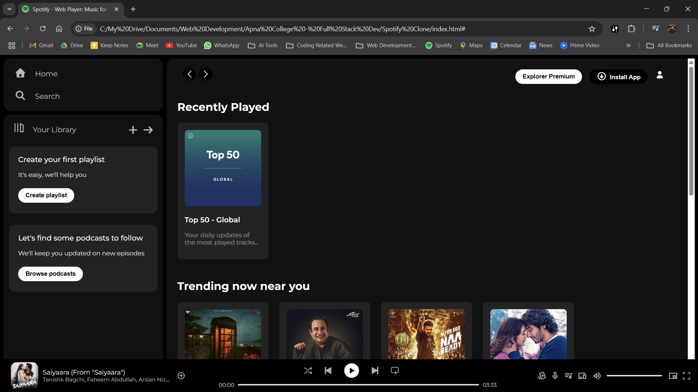

# 🎵 Spotify Homepage Clone

A front-end clone of the **Spotify homepage** built using **HTML5** and **CSS3**. This project replicates the design and layout of Spotify’s official landing page for learning and practice purposes.

## 📄 About

This is a static and responsive UI clone focused on layout, styling, and design using only HTML and CSS — no interactivity or backend features are included.

## 🚀 Features

- Clean and responsive layout
- Custom buttons and hover effects
- Use of Google Fonts and Font Awesome icons
- Layout built with Flexbox and Grid

## 🛠️ Tech Stack

- HTML5
- CSS3
- Google Fonts
- Font Awesome

## 📷 Preview



## 📁 Project Structure

```
spotify-homepage-clone/
├── index.html
├── style.css
├── preview.png
└── assets/
```

## 📌 Note

This project is for educational purposes only. All copyrights belong to **Spotify**.

## 🔗 Live Demo

[View Live](https://aniprogramer.github.io/spotify-homepage-clone/) <!-- Add your hosted site link here if available -->

